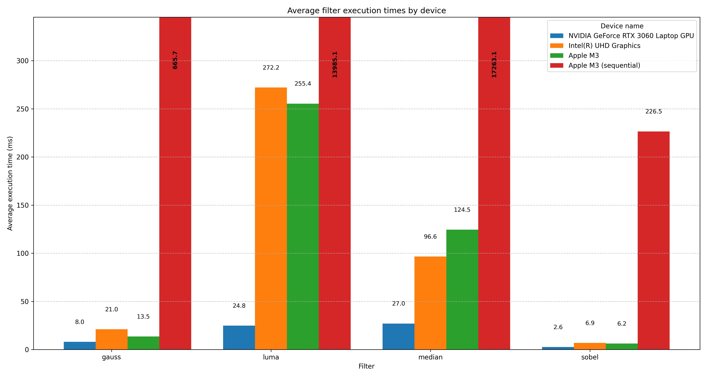

# Beadandó

## OpenCL Kép Szűrési Projekt

### Projekt Leírása

Ez a projekt egy OpenCL-alapú képszűrő eszközt valósít meg, amely képes különböző szűrések (Sobel, Gauss, Medián) színes vagy szürkeárnyalatos képeken. A szűrés típusa, a bemenet, a kimenet és a platform(melyik gpu számmal) parancssori kapcsolókon keresztül állítható be.

### Fő Funkciók

- **RGB és szürkeárnyalatos képek támogatása**
- **Sobel szűrő**: autómatikusan átalakítja a képet szürkeárnyalatosra, majd éldetektálást végez
- **Gauss szűrő**: zajcsökkentő elmosás szines képeken is
- **Medián szűrő**: zajeltávolítás színes képeken is
- **Luma szűrő**: zajeltávolítás csak a fény erősség figyelembevételével
- **OpenCL GPU eszközválasztás**
- **Autómatikus mentés PNG formátumba**
- **Szekvenciális futtatás CPU-n**

### Használat

```bash
./image-filter \
	--input input.jpg \
	--output output.png \
	--filter sobel|gauss|median|luma \
	--device [number]
```

vagy ha az összesen filteren és képen szeretnéd futtatni akkor(gyökér mappában):

```
./run_all_filters.sh [number, cpu esetén -2]
```

### Fájlstruktúra

```
Parallel-devices/
├── beadando/ # A beadandó projekt (korábbi src/)
│ ├── image_filter.c # Főprogram (host kód)
│ ├── filters.c # OpenCL eszközök, kernel hívás
│ ├── filters_cpu.c # Filterek szekvenciális futtatása CPU-n
│ ├── filters.h # Header
│ └── kernels.cl # OpenCL kernelkód
│
├── include/
│ ├── stb_image.h # Kép beolvasáshoz
│ └── stb_image_write.h # Kép mentéshez
│
├── images/
│ ├── input[number].jpeg # Tesztbemenet
│ └── outputs/ # Eredményképek
│   └── output[number]_[filter]_[device].png #Eredménykép
├── build/ # Fordított binárisok helye
│ └── (ide kerül a `beadando/image_filter` vagy más feladat binárisa)
│
├── lesson_tasks/ # Órai projektek mappába rendezve
│
├── Makefile # Általános makefile (moduláris)
├── run_all_filters.sh
├── compile.ps1
├── run_all_filters.ps1
├── generate_graph.py # gráf generálás az adatokból
├── README.md # A beadandó dokumentációja
└── measurements.csv # Mérési eredmények külön fájlban
```

### Mérési Eredmények



#### **Apple M3**

| Fájlnév     | Szűrő  | Szélesség | Magasság | Futási idő (ms) |
| ----------- | ------ | --------- | -------- | --------------- |
| input1.jpeg | sobel  | 1024      | 1024     | 3.570           |
| input1.jpeg | gauss  | 1024      | 1024     | 2.584           |
| input1.jpeg | median | 1024      | 1024     | 18.304          |
| input1.jpeg | luma   | 1024      | 1024     | 28.371          |
| input2.jpeg | sobel  | 4032      | 3024     | 9.415           |
| input2.jpeg | gauss  | 4032      | 3024     | 11.583          |
| input2.jpeg | median | 4032      | 3024     | 166.031         |
| input2.jpeg | luma   | 4032      | 3024     | 334.449         |
| input3.jpeg | sobel  | 1024      | 1024     | 2.863           |
| input3.jpeg | gauss  | 1024      | 1024     | 3.485           |
| input3.jpeg | median | 1024      | 1024     | 21.765          |
| input3.jpeg | luma   | 1024      | 1024     | 30.101          |
| input4.jpeg | sobel  | 4032      | 3024     | 4.720           |
| input4.jpeg | gauss  | 4032      | 3024     | 24.012          |
| input4.jpeg | median | 4032      | 3024     | 162.819         |
| input4.jpeg | luma   | 4032      | 3024     | 330.334         |
| input5.jpeg | sobel  | 5472      | 3648     | 10.319          |
| input5.jpeg | gauss  | 5472      | 3648     | 26.001          |
| input5.jpeg | median | 5472      | 3648     | 253.697         |
| input5.jpeg | luma   | 5472      | 3648     | 553.783         |

#### **Intel(R) UHD Graphics**

| Fájlnév     | Szűrő  | Szélesség | Magasság | Futási idő (ms) |
| ----------- | ------ | --------- | -------- | --------------- |
| input1.jpeg | sobel  | 1024      | 1024     | 3.433           |
| input1.jpeg | gauss  | 1024      | 1024     | 3.998           |
| input1.jpeg | median | 1024      | 1024     | 13.034          |
| input1.jpeg | luma   | 1024      | 1024     | 30.002          |
| input2.jpeg | sobel  | 4032      | 3024     | 8.033           |
| input2.jpeg | gauss  | 4032      | 3024     | 27.000          |
| input2.jpeg | median | 4032      | 3024     | 127.000         |
| input2.jpeg | luma   | 4032      | 3024     | 360.998         |
| input3.jpeg | sobel  | 1024      | 1024     | 1.964           |
| input3.jpeg | gauss  | 1024      | 1024     | 2.999           |
| input3.jpeg | median | 1024      | 1024     | 12.008          |
| input3.jpeg | luma   | 1024      | 1024     | 30.005          |
| input4.jpeg | sobel  | 4032      | 3024     | 9.002           |
| input4.jpeg | gauss  | 4032      | 3024     | 26.000          |
| input4.jpeg | median | 4032      | 3024     | 127.008         |
| input4.jpeg | luma   | 4032      | 3024     | 355.998         |
| input5.jpeg | sobel  | 5472      | 3648     | 12.000          |
| input5.jpeg | gauss  | 5472      | 3648     | 45.042          |
| input5.jpeg | median | 5472      | 3648     | 203.996         |
| input5.jpeg | luma   | 5472      | 3648     | 584.000         |

#### **NVIDIA GeForce RTX 3060 Laptop GPU**

| Fájlnév     | Szűrő  | Szélesség | Magasság | Futási idő (ms) |
| ----------- | ------ | --------- | -------- | --------------- |
| input1.jpeg | sobel  | 1024      | 1024     | 0.000           |
| input1.jpeg | gauss  | 1024      | 1024     | 1.000           |
| input1.jpeg | median | 1024      | 1024     | 2.996           |
| input1.jpeg | luma   | 1024      | 1024     | 3.008           |
| input2.jpeg | sobel  | 4032      | 3024     | 2.967           |
| input2.jpeg | gauss  | 4032      | 3024     | 12.000          |
| input2.jpeg | median | 4032      | 3024     | 34.998          |
| input2.jpeg | luma   | 4032      | 3024     | 31.999          |
| input3.jpeg | sobel  | 1024      | 1024     | 0.959           |
| input3.jpeg | gauss  | 1024      | 1024     | 1.989           |
| input3.jpeg | median | 1024      | 1024     | 2.999           |
| input3.jpeg | luma   | 1024      | 1024     | 4.001           |
| input4.jpeg | sobel  | 4032      | 3024     | 2.997           |
| input4.jpeg | gauss  | 4032      | 3024     | 10.000          |
| input4.jpeg | median | 4032      | 3024     | 33.998          |
| input4.jpeg | luma   | 4032      | 3024     | 30.969          |
| input5.jpeg | sobel  | 5472      | 3648     | 5.997           |
| input5.jpeg | gauss  | 5472      | 3648     | 14.998          |
| input5.jpeg | median | 5472      | 3648     | 59.999          |
| input5.jpeg | luma   | 5472      | 3648     | 54.000          |

#### **Apple M3 (sequential)**

| Fájlnév     | Szűrő  | Szélesség | Magasság | Futási idő (ms) |
| ----------- | ------ | --------- | -------- | --------------- |
| input1.jpeg | sobel  | 1024      | 1024     | 31.26           |
| input1.jpeg | gauss  | 1024      | 1024     | 73.35           |
| input1.jpeg | median | 1024      | 1024     | 1270.73         |
| input1.jpeg | luma   | 1024      | 1024     | 920.89          |
| input2.jpeg | sobel  | 4032      | 3024     | 306.39          |
| input2.jpeg | gauss  | 4032      | 3024     | 860.04          |
| input2.jpeg | median | 4032      | 3024     | 20964.81        |
| input2.jpeg | luma   | 4032      | 3024     | 18060.18        |
| input3.jpeg | sobel  | 1024      | 1024     | 25.05           |
| input3.jpeg | gauss  | 1024      | 1024     | 73.51           |
| input3.jpeg | median | 1024      | 1024     | 1163.78         |
| input3.jpeg | luma   | 1024      | 1024     | 894.09          |
| input4.jpeg | sobel  | 4032      | 3024     | 285.73          |
| input4.jpeg | gauss  | 4032      | 3024     | 902.41          |
| input4.jpeg | median | 4032      | 3024     | 22412.43        |
| input4.jpeg | luma   | 4032      | 3024     | 18278.66        |
| input5.jpeg | sobel  | 5472      | 3648     | 484.22          |
| input5.jpeg | gauss  | 5472      | 3648     | 1419.17         |
| input5.jpeg | median | 5472      | 3648     | 40503.67        |
| input5.jpeg | luma   | 5472      | 3648     | 31771.53        |

### measurements.csv példa

```
input_file,filter,device_name,width,height,elapsed_time(ms)
input1.jpeg,sobel,NVIDIA GeForce RTX 3060 Laptop GPU,1024,1024,0.0000000000
input1.jpeg,gauss,NVIDIA GeForce RTX 3060 Laptop GPU,1024,1024,1.0000000000
input1.jpeg,median,NVIDIA GeForce RTX 3060 Laptop GPU,1024,1024,2.9960000000
input1.jpeg,luma,NVIDIA GeForce RTX 3060 Laptop GPU,1024,1024,3.0080000000
input2.jpeg,sobel,NVIDIA GeForce RTX 3060 Laptop GPU,4032,3024,2.9670000000
input2.jpeg,gauss,NVIDIA GeForce RTX 3060 Laptop GPU,4032,3024,12.0000000000
input2.jpeg,median,NVIDIA GeForce RTX 3060 Laptop GPU,4032,3024,34.9980000000
...
```

### Követelmények

- OpenCL SDK
- C fordító (pl. gcc vagy clang)
- stb_image.h és stb_image_write.h a `include/` könyvtárban

### Fordítás

```bash
make FOLDER=image_filter
```

### Licensz

Ez a projekt MIT licensz alatt kerül megosztásra.

```text
MIT License

Copyright (c) 2025 Tóth Tamás

Permission is hereby granted, free of charge, to any person obtaining a copy
of this software and associated documentation files (the "Software"), to deal
in the Software without restriction, including without limitation the rights
to use, copy, modify, merge, publish, distribute, sublicense, and/or sell
copies of the Software, and to permit persons to whom the Software is
furnished to do so, subject to the following conditions:

The above copyright notice and this permission notice shall be included in all
copies or substantial portions of the Software.

THE SOFTWARE IS PROVIDED "AS IS", WITHOUT WARRANTY OF ANY KIND, EXPRESS OR
IMPLIED, INCLUDING BUT NOT LIMITED TO THE WARRANTIES OF MERCHANTABILITY,
FITNESS FOR A PARTICULAR PURPOSE AND NONINFRINGEMENT. IN NO EVENT SHALL THE
AUTHORS OR COPYRIGHT HOLDERS BE LIABLE FOR ANY CLAIM, DAMAGES OR OTHER
LIABILITY, WHETHER IN AN ACTION OF CONTRACT, TORT OR OTHERWISE, ARISING FROM,
OUT OF OR IN CONNECTION WITH THE SOFTWARE OR THE USE OR OTHER DEALINGS IN THE
SOFTWARE.
```
